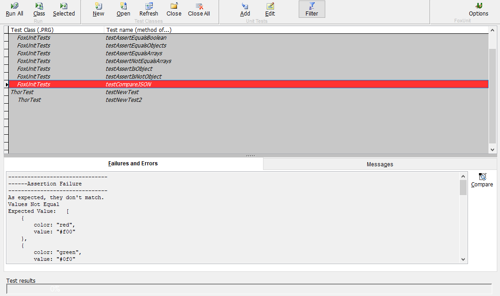
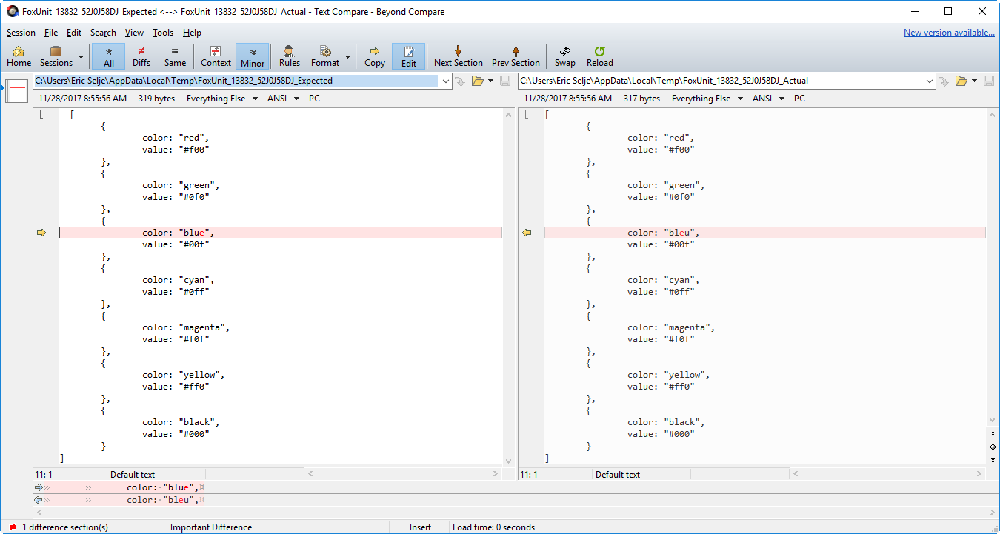
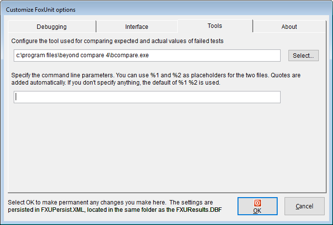

## 比较结果
 
Christof Wollenhaupt 在 1.7 版本中添加了一项功能，允许 FoxUnit 使用外部工具来比较单元测试的结果。 这使得比较实际值和期望值(例如JSON或XML)变得更加容易。

在添加此功能之前，比较长值是困难的：

但是单击“比较”按钮会显示您最喜欢的第三方工具，以便于比较：

### 配置
要将FoxUnit配置为使用首选比较/差异工具，请单击“选项”并选择“工具”选项卡：

