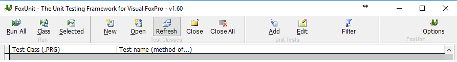
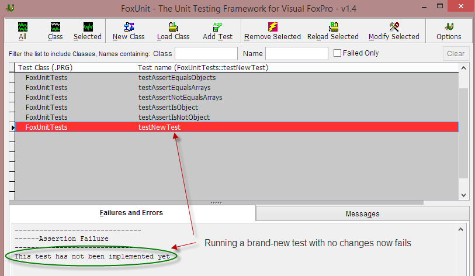
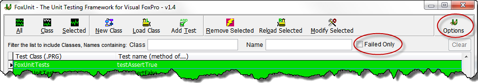
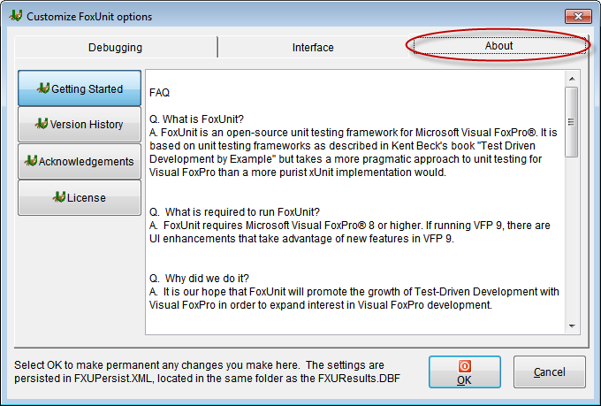
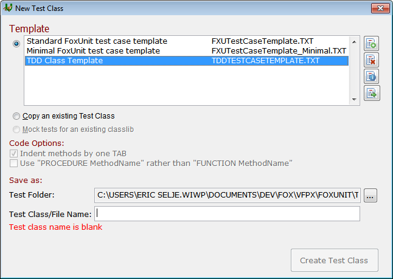

## 更新历史

**Version 1.7 - November 28, 2017**
* 每个测试都在其自己的数据工作期中运行，以实现最佳封装和复用性。
* 增加[比较](FoxUnit_CompareButton_CN.md)功能，使分析更多的结果更容易。

**Version 1.61 - September 15, 2017**
* 取消删除类工厂基表中导致 FoxUnit 在启动时失败的类。
* 修复了编辑后重新加载测试的 BUG。

**Version 1.6 - September 20, 2016**
* 使用 Visual Studio Graphics Library 中的图标。
* 将图标分组为更合理的排列，包括组标题。
* 添加了使用类库中所有未实现测试创建测试类的功能。
* 允许对测试成功/失败自定义颜色。
* 除非打开过滤器切换，否则隐藏过滤器面板。

**Version 1.51 - July 29, 2015**
* 将许多表单重构为新 fxuFrmUser 的子类，它包含 ioFxuInstance 对象以及 SettingsSave() 和 SettingsRestore() 函数。
* 移除检查所进行的测试是否在 FoxUnit Path 中。
* 在 fxu_fxuFrmUserTests.prg 中为表单添加了更多单元测试。
* 其他 U/I 清理。
* 切换到 FoxBin2Prg for SCM 。

**Version 1.5 - July 13, 2015**
* 增加新类 fxu.fxuInstance 。
* 移除 fxuShowForm.prg 。
* 移除 fxuNewObject.prg 。

(请在此处查看完整的更改列表 - [FoxUnit 1.5 完整更新列表](FoxUnit-1.5-Full-Changes_CN.md))

**Version 1.42**
* 添加了在每次运行之间保留先前测试的可视结果的选项。

**Version 1.41 - November 11, 2014**
* 添加了一个新的判断，AssertNotImplemented() 。
* 使原有的函数可以调用新增的测试。
* 将新测试的名称更改为 testNewTest 以符合以 'test' 开头的测试名称标准。
* 问题是，如果添加了新测试但没有编写测试代码，那么该测试将通过。这是错的。现在，新测试将失败，并显示“尚未实现”消息，向开发人员表明测试尚未编写。

**Version 1.4 - August 1, 2014**
* 添加了一个过滤器，仅显示失败的测试。
* 将“选项”按钮提升到主表单。

* 在“选项”表单中添加了“关于”选项卡，以便于访问许可协议，入门，鸣谢和版本历史记录。

* 为清晰起见，重新编写了新测试类表单(和基础类)。

**Version 1.3 - July 29, 2014**

Burkhard Stiller添加了以下测试：

* AssertEqualsArrays
* AssertEqualsObjects
* AssertEqualsValues
* AssertHasError
* AssertHasErrorNo
* AssertIsObject

[Eric Selje](https://github.com/ESelje) 添加了一个单元测试，用以判断 FoxUnit 并没有被破坏。

**Version 1.21 - July 11, 2014**

Doug Meerschaert 发现了一个导致 AssertEquals 忽略 NonCaseSensitive 标志的错误(工作项目34625)。

**Version 1.2 - July 9, 2014**

[Fernando Bozzo](https://github.com/fdbozzo/) 提交了以下的更新：

* 在 FXU 主窗口中，编辑框的字体更改为 Courier New 以增强表格数据的输出。
* 解决了数据路径的一些历史问题(或者我认为是这样，阅读代码上的注释)。
* 配置用于搜索的文本框的 Anchor (条件：version(5) > = 900)。
* 增加了使用这种 DOS 语法从 CruiseControl 等CI服务器运行FoxUnit的可能性：<path> \ foxunit.app createFxuResultsAddAllTestsAndRun
* 完善各种 ENDPROC / ENDFUNC 结构。
* 使用 STRCONV(Logtext，9) 转换的文本日志，用于支持特殊字符(西班牙语，德语等)。
* 扩展了测试用例加载表单的默认大小，因为在使用 BDD 样式命名时，它们对于大型测试名称来说太小(描述测试的详细名称)。
* 考虑到 800x600 的最小保守设置，扩展了 FoxUnit 主窗口的默认大小。
* 扩展 TClass C(80) 到 C(110) ==> 所以单元测试文件名可以是 'ut_libraryName__className__methodName.prg' 。
* 扩展 TName C(100) 到 C(130) ==> 所以方法名称可以是'SHOULD_DoSomething__WHEN_SomeConditions' 。
* Fxu.prg => 从CI服务器执行时添加了 AlwaysOnTop 和 Zoom Max(createFxuResultsAddAllTestsAndRun过程)。
* fxuresultdata.prg => 错误修复：发现一个非常老的错误，有时在主窗口上过滤测试并添加新测试时会抛出错误。
* 所有更改都向后兼容。

**Version 1.11 - Nov 2013**

[Matt Slay](https://github.com/mattslay) 引入了一个分割条(使用 SFSplitter 类库)将测试与结果分开。

**Version 1.1 - Sept 2012**

VFPX 中的第一个版本。使用 H. Alan Stevens 提交的更新标准化 Assert 调用的参数顺序。
